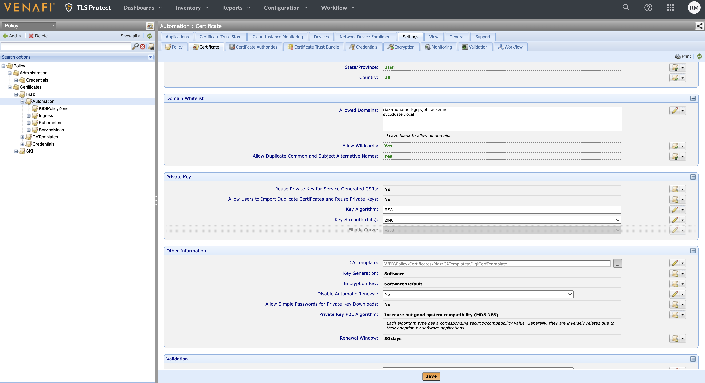
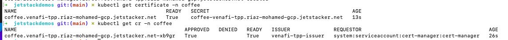
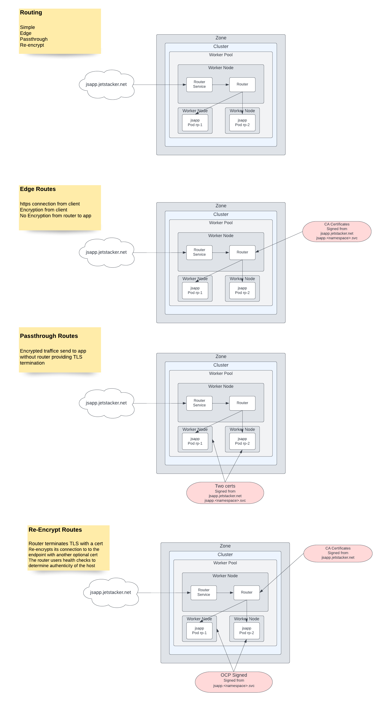

# JET STACK DEMOS


Table of Contents
=================

[Introduction](#introduction)

[Kubernetes Ingress](#Kubernetes-Ingress)

[Issuers](#Issuers)

[Configuring TPP](#Configuring-TPP)

Cert Manager

Usecase 1: Securing an Ingress


- [Introduction](#introduction)
- [Kubernetes Ingress](#Kubernetes-Ingress)
- [Issuers](#Issuers)
- [Configuring TPP](#Configuring-TPP)
- [Cert Manager](#Cert-Manager)
- [Usecase 1: Securing an Ingress](#Usecase-1:-Securing-an-Ingress)
  * [Create Deployments and Expose Services](#Create-Deployments-and-Expose-Services)
  * [Configure an Ingress](#Configure-an-Ingress)
  * [Creating Namespace and Cluster scoped Issuers](#Creating-Namespace-and-Cluster-scoped-Issuers)
  * [Creating Certificate Resources](#Creating-Certificate-Resources)
  * [Enable Ingress TLS](#Enable-Ingress-TLS)
  * [Test TLS](#Test-TLS)
- [Usecase 2: Securing Openshift Routes](#Usecase-2:-Securing-Openshift-Routes)

Introduction
============

Jetstack Secure provides both operations and security teams with a stand-out solution that best meets their respective needs for a high-level of platform automation, coupled with best practice security. With cert-manager (created and maintained primarily by Jetstack, a Venafi company)  at its core, Jetstack Secure delivers comprehensive and highly-automated protection of machine identities, including public trusted certificates for ingress TLS, as well as private certificates for internal workloads using mTLS, including service mesh. It gives platform Leads the confidence to scale-up infrastructure, with full automation that adheres to enterprise security standards and gives both platform and security teams complete visibility, across multiple clusters and cloud providers. 

This guide will go through different usecases and the usage of cert-manager and jetstack secure.

Kubernetes Ingress
============================

Ingress exposes HTTP and HTTPS routes from outside the cluster to services within the cluster. Traffic routing is controlled by rules defined on the Ingress resource.

An Ingress may be configured to give Services externally-reachable URLs, load balance traffic, terminate SSL / TLS, and offer name-based virtual hosting. An Ingress controller is responsible for fulfilling the Ingress, usually with a load balancer, though it may also configure your edge router or additional frontends to help handle the traffic.

An Ingress does not expose arbitrary ports or protocols. Exposing services other than HTTP and HTTPS to the internet typically uses a service of type Service.Type=NodePort or Service.Type=LoadBalancer.


Issuers
============================
Issuers, and ClusterIssuers, are Kubernetes resources that represent certificate authorities (CAs) that are able to generate signed certificates by honoring certificate signing requests. All cert-manager certificates require a referenced issuer that is in a ready condition to attempt to honor the request.

### Venafi Issuer

The Venafi Issuer types allows you to obtain certificates from Venafi as a Service (VaaS) and Venafi Trust Protection Platform (TPP) instances.
You can have multiple different Venafi Issuer types installed within the same cluster, including mixtures of Venafi as a Service and TPP issuer types. 

Automated certificate renewal and management are provided for Certificates using the Venafi Issuer.

## Create an Issuer Resource
A single Venafi Issuer represents a single Venafi 'zone' so you must create one Issuer resource for each zone you want to use. A zone is a single entity that combines the policy that governs certificate issuance with information about how certificates are organized in Venafi to identify the business application and establish ownership.

Issuers can be namespace scoped or cluster scoped

## Certificate Resource

In cert-manager, the Certificate resource represents a human readable definition of a certificate request that is to be honored by an issuer which is to be kept up-to-date. This is the usual way that you will interact with cert-manager to request signed certificates.

A Certificate resource specifies fields that are used to generate certificate signing requests which are then fulfilled by the issuer type you have referenced.


# Configuring TPP
https://TPPURL/vedadmin/

## Create CA Templates
Right Click and add CA template


## Zone / Policies
Create a policies, create nested if required. We will create a policy zone where the certificates requested by certmanager will land.


## Configure Policy

Update the following . 
Certificate tab --> Domain Whitelist to add the allowed domains 
Certificate tab --> Other Information --> Select the CA template




## Generate API Key
The Api key will be used to authenticate between CertManager and the TPP server


## Download TPP CA Bundle

Download the TPP server CA bundle. Copy it top a file tppcabundle.pem


# Cert Manager
Cert-manager adds certificates and certificate issuers as resource types in Kubernetes clusters, and simplifies the process of obtaining, renewing and using those certificates.
It can issue certificates from a variety of supported sources, including Let's Encrypt, HashiCorp Vault, and Venafi as well as private PKI.

It will ensure certificates are valid and up to date, and attempt to renew certificates at a configured time before expiry.

It is loosely based upon the work of kube-lego and has borrowed some wisdom from other similar projects such as kube-cert-manager.

> kubectl get po -A

### Deploy Certmanager to the target cluster
 > kubectl apply -f https://github.com/cert-manager/cert-manager/releases/download/v1.8.0/cert-manager.yaml

 NOTE: Deploy the latest version as per docs : https://cert-manager.io/docs/installation/ . The current version as per authoring this guide is v1.80


Usecase 1: Securing an Ingress
================================
In this use case we will use Venafi TPP to issue signed certificates. We will also be creating both namesapace scoped issuers as well as cluster scoped issuers that connect to 
the TPP server to provision the certificates. We will then deploy a sample application , create certificates resources referenceing the issuers. We will also be creating Ingress resources to secure the applications utilizing certs generated from TPP.


## Create Deployments and Expose Services

```yaml
---
kind: Namespace
apiVersion: v1
metadata:
  name: tea
  labels:
    app: tea
---
kind: Namespace
apiVersion: v1
metadata:
  name: coffee
  labels:
    app: coffee
---
apiVersion: apps/v1
kind: Deployment
metadata:
  name: tea
  namespace: tea
spec:
  replicas: 3
  selector:
    matchLabels:
      app: tea
  template:
    metadata:
      labels:
        app: tea
    spec:
      containers:
      - name: tea
        image: nginxdemos/nginx-hello
        ports:
        - containerPort: 8080
---
apiVersion: v1
kind: Service
metadata:
  name: tea-svc
  namespace: tea
  labels:
spec:
  ports:
  - port: 80
    targetPort: 8080
    protocol: TCP
    name: http
  selector:
    app: tea
  sessionAffinity: None
  type: ClusterIP

---
apiVersion: apps/v1
kind: Deployment
metadata:
  name: coffee
  namespace: coffee
spec:
  replicas: 2
  selector:
    matchLabels:
      app: coffee
  template:
    metadata:
      labels:
        app: coffee
    spec:
      containers:
      - name: coffee
        image: nginxdemos/nginx-hello
        ports:
        - containerPort: 8080
---
apiVersion: v1
kind: Service
metadata:
  name: coffee-svc
  namespace: coffee
  labels:
spec:
  ports:
  - port: 80
    targetPort: 8080
    protocol: TCP
    name: http
  selector:
    app: coffee
  sessionAffinity: None
  type: ClusterIP
---
```

> kubectl apply -f ./kubernetes/ingress/deployment.yaml

## Configure an Ingress

> kubectl apply -f ./kubernetes/ingress/ingress.yaml

> kubectl get ingress -n tea


Update DNS record to point the host to the ipaddress

NOTE: Only port 80 is exposed on the ingress

Access the application


## Creating Namespace and Cluster scoped Issuers

As described earlier an Issuer can be either namespace or cluster scoped. 

Creating an issuer requires a TPP instance in this case, the TPP CA bundle , A Policy zone withing tpp with permissions and a secret.
We also require a secret that stores the credentials to access the TPP api instance to life manage certs.

### Create a secret with the access token retrieved from the previous step

Get access key from TPP

NOTE:  Download vcert
> vcert getcred --username REPLACE WITH USER-NAME API CLIENT IS ASSIGNED \
>               --password REPLACE WITH PASSWORD API CLIENT IS ASSIGNED \
>               -u https://REPLACE WITH TPP INSTANCE URL/vedsdk \
>               --client-id REPLACE WITH API CLIENT ID \
>               --scope "certificate:manage,revoke" 


Copy the access_token


Create a secret with the access token retrieved from the previous step

> kubectl create secret generic tpp-auth-secret --namespace='coffee' --from-literal=access-token='<REPLACE WITH ACCESS TOKEN>'


>
> kubectl get secret -n coffee


Convert the tpp server bundle to base64

> echo "$(<tppcabundle.pem)" | base64

Create the namespace scoped issuer, replace all required values in the issuer yaml. 

### Namespace scoped Issuer

```yaml
apiVersion: cert-manager.io/v1
kind: Issuer
metadata:
  name: venafi-tpp-issuer
  namespace: venafi-tpp
spec:
  venafi:
    zone: "<REPLACE WITH PATH TO POLICY ZONE>" #"TLS/SSL\\Certificates\\Jetstack-short"
    tpp:
      url: <REPLACE WITH TPPURL/vedsdk> # Change this to the URL of your TPP instance
      caBundle: <REPLACE WITH TPP BASE 64 ENCODED CA BUNDLE>
      credentialsRef:
        name: <REPLACE WITH TPP SECRET> # A Secret needs to be created with TPP credentials 
```

Creating an issuer requires a TPP instance in this case, the TPP CA bundle , A Policy zone withing tpp with permissions and a secret.
We also require a secret that stores the credentials to access the TPP api instance to life manage certs.

NOTE: Update the namespace-issuer.yaml under ./kubernetes/ingress before running this command

> kubectl apply -f ./kubernetes/ingress/namespace-issuer.yaml

Check issuer status

> kubectl get issuer -A 


### Cluster scoped Issuer

NOTE: Create a secret with the access token retrieved from the previous step

NOTE: The namespace for the cluster issuer is the cert-manager


> kubectl create secret generic tpp-cluster-secret --namespace='cert-manager' --from-literal=access-token='<REPLACE WITH ACCESS TOKEN>'

Check if the secrets are created 

> kubectl get secret -n cert-manager

```yaml
apiVersion: cert-manager.io/v1
kind: ClusterIssuer
metadata:
  name: venafi-tpp-cluster-issuer
spec:
  venafi:
    zone: "<REPLACE WITH PATH TO POLICY ZONE>" #"TLS/SSL\\Certificates\\Jetstack-short"
    tpp:
      url: <REPLACE WITH TPPURL/vedsdk> # Change this to the URL of your TPP instance
      caBundle: <REPLACE WITH TPP BASE 64 ENCODED CA BUNDLE>
      credentialsRef:
        name: <REPLACE WITH TPP SECRET> # A Secret needs to be created with TPP credentials 
```

Creating an issuer requires a TPP instance in this case, the TPP CA bundle , A Policy zone withing tpp with permissions and a secret.
We also require a secret that stores the credentials to access the TPP api instance to life manage certs.

NOTE: Update the cluster-issuer.yaml under ./kubernetes/ingress before running this command

> kubectl apply -f ./kubernetes/ingress/cluster-issuer.yaml


Check cluster clusterissuer status

> kubectl get clusterissuer -A 


## Creating Certificate Resources


A Certificate resource specifies fields that are used to generate certificate signing requests which are then fulfilled by the issuer type you have referenced.

### Cert for namespaced issuer
Let us create a certificate in the coffee namespace with the namespace scoped issuer we created in precious steps

```yaml
---
apiVersion: cert-manager.io/v1
kind: Certificate
metadata:
  name: venafi-tpp.REPLACE_DOMAIN_NAME
  namespace: coffee
spec:
  secretName: coffee-venafi-tpp.REPLACE_DOMAIN_NAME
  # At least one of a DNS Name, URI, or IP address is required.
  dnsNames:
    - coffee.venafi-tpp.REPLACE_DOMAIN_NAME
  #uris:
  #  - spiffe://cluster.local/ns/sandbox/sa/example
  #ipAddresses:
  #  - 192.168.0.5
  commonName: coffee.venafi-tpp.REPLACE_DOMAIN_NAME
  privateKey: 
    rotationPolicy: Always
  #duration: 2160h # 90d
  renewBefore: 360h # 15d
  #subject:
    #organizations:
      #- jetstack
  # The use of the common name field has been deprecated since 2000 and is
  # discouraged from being used. Use these if any policies are enforced on cert creation with TPP
  #commonName: example.com
  #isCA: false
  #privateKey:
    #algorithm: RSA
    #encoding: PKCS1
    #size: 2048
  #usages:
    #- server auth
    #- client auth
  issuerRef:
    name: venafi-tpp-issuer
    kind: Issuer
    # This is optional since cert-manager will default to this value however
    # if you are using an external issuer, change this to that issuer group.
    # group: cert-manager.io
```

REPLACE values as required in ./kubernetes/ingress/certificate.yaml 

> kubectl apply -f ./kubernetes/ingress/certificate.yaml

Check status of the certificate and certificate resource

> kubectl get certificate -n coffee
>
> kubectl get cr -n coffee



### Cert for cluster issuer

Let us create a certificate in the tea namespace with cluster scoped issuer we created in precious steps

```yaml
---
apiVersion: cert-manager.io/v1
kind: Certificate
metadata:
  name: tea.venafi-tpp.REPLACE_DOMAIN_NAME
  namespace: tea
spec:
  secretName: tea-venafi-tpp.REPLACE_DOMAIN_NAME
  # At least one of a DNS Name, URI, or IP address is required.
  dnsNames:
    - tea.venafi-tpp.REPLACE_DOMAIN_NAME
  #uris:
  #  - spiffe://cluster.local/ns/sandbox/sa/example
  #ipAddresses:
  #  - 192.168.0.5
  commonName: tea.venafi-tpp.REPLACE_DOMAIN_NAME
  privateKey: 
    rotationPolicy: Always
  #duration: 2160h # 90d
  renewBefore: 360h # 15d
  #subject:
    #organizations:
      #- jetstack
  # The use of the common name field has been deprecated since 2000 and is
  # discouraged from being used. Use these if any policies are enforced on cert creation with TPP
  #commonName: example.com
  #isCA: false
  #privateKey:
    #algorithm: RSA
    #encoding: PKCS1
    #size: 2048
  #usages:
    #- server auth
    #- client auth
  issuerRef:
    name: cluster-venafi-tpp-issuer
    kind: ClusterIssuer
    # This is optional since cert-manager will default to this value however
    # if you are using an external issuer, change this to that issuer group.
    # group: cert-manager.io
```

REPLACE values as required in ./kubernetes/ingress/cluster-certificate.yaml 

> kubectl apply -f ./kubernetes/ingress/cluster-certificate.yaml

Check status of the certificate and certificate resource

> kubectl get certificate -n tea
>
> kubectl get cr -n tea


## Check if certificate is issued in TPP

Login to TPP and check if certificates have been provisioned


## Enable Ingress TLS

Let us enable tls for both the tea and coffee applications

```yaml
 apiVersion: networking.k8s.io/v1
 kind: Ingress
 metadata:
   name: venafi-tpp-demo1-ingress-coffee
   namespace: coffee
   annotations:
     nginx.ingress.kubernetes.io/rewrite-target: /$1
 spec:
   ingressClassName: nginx
   tls:
   - hosts:
     - coffee.venafi-tpp.REPLACE_DOMAIN_NAME
     secretName: coffee-venafi-tpp.REPLACE_DOMAIN_NAME
   rules:
   - host: coffee.venafi-tpp.REPLACE_DOMAIN_NAME
     http:
       paths:
       - path: /coffee
         pathType: Prefix
         backend:
           service:
              name: coffee-svc
              port: 
                number: 80
```

REPLACE values as required in the files .

> kubectl apply -f ./kubernetes/ingress/ingress-tls-coffee.yaml

> kubectl apply -f ./kubernetes/ingress/ingress-tls-tea.yaml


Note: We are now exposing port 443 as well

## Test TLS

Let us now look at how our ingresses look like

> kubectl get ing -A


Update DNS record to point the host to the ipaddress

Point the browser to the host name of the app Eg. https://tea.venafi-tpp.riaz-mohamed-gcp.jetstacker.net/tea


Point the browser to the host name of the app Eg. https://coffee.venafi-tpp.riaz-mohamed-gcp.jetstacker.net/coffee


The apps are now secure.

[Usecase 2: Securing Openshift Routes](#Usecase-2:-Securing-Openshift-Routes)

Usecase 2: Securing Openshift Routes
=====================================
In this use case we will use Venafi TPP to issue signed certificates. We will be openshift as the kubernetes platform. We will also be creating both namesapace scoped issuers as well as cluster scoped issuers that connect to the TPP server to provision the certificates. We will then deploy a sample application , create certificates resources referenceing the issuers. We will also be creating Ingress resources to secure the applications utilizing certs generated from TPP.


An OpenShift Container Platform route exposes a service at a host name, such as www.example.com, so that external clients can reach it by name. There are four kinds of
routing within openshift. 
Simple
Edge
Passthrough
Re-encrypt

Currently cert-manager supports creating an ingress withing Openshift which in turn creates a route of type Edge in openshift.




Pre Reqs: Deploy Cert manager

> kubectl apply -f https://github.com/cert-manager/cert-manager/releases/download/v1.8.0/cert-manager.yaml

 NOTE: Deploy the latest version as per docs : https://cert-manager.io/docs/installation/ . The current version as per authoring this guide is v1.80

 


 [Create Deployments and Expose Services](#Create-Deployments-and-Expose-Services)

 > oc apply -f ./openshift/routes/deployment.yaml

  

 [Configure an Ingress](#Configure-an-Ingress)

 > oc apply -f ./openshift/routes/

 Check if the route and the ingress is created

 > oc get routes -n tea
 >
 > oc get ingress -n tea

 Login to the open shift console and check the route and the route definition

 

 
 
 Update DNS in this case my oc dns is localhost or 127.0.0.0 pointing to tea.oc.venafi-tpp.riaz-mohamed-gcp.jetstacker.net
 
 Point the browser to the http://tea.oc.venafi-tpp.riaz-mohamed-gcp.jetstacker.net/tea and check

 

 [Creating Namespace and Cluster scoped Issuers](#Creating-Namespace-and-Cluster-scoped-Issuers)
 
## Create Secrets to authenticate against TPP

Create a secret with the access token to connect to tpp for oth cluster scoped and namespace scoped issuers

### Namespaced scoped issuer

> oc create secret generic tpp-auth-secret --namespace='coffee' --from-literal=access-token='<REPLACE WITH ACCESS TOKEN>'
>
> oc get secret -n coffee

### Cluster scoped issuer

> oc create secret generic tpp-cluster-secret --namespace='cert-manager' --from-literal=access-token='<REPLACE WITH ACCESS TOKEN>'
>
> oc get secret -n cert-manager


## Create the namespace scoped issuer

REPLACE values as required in the files ( ./openshift/routes/namespace-issuer.yaml )

>  oc apply -f ./openshift/routes/namespace-issuer.yaml 

Check Status of the issuer

> oc get issuer -n coffee


## Create the cluster scoped issuer

REPLACE values as required in the files ( ./openshift/routes/cluster-issuer.yaml  )

>  oc apply -f ./openshift/routes/cluster-issuer.yaml 

Check Status of the cluster-issuer

> oc get clusterissuer -n coffee


 [Creating Certificate Resources](#Creating-Certificate-Resources)

REPLACE values as required in the files ( ./openshift/routes/certificate.yaml & cluster-certificate.yaml)

Created under the coffee namespace
>  oc apply -f ./openshift/routes/certificate.yaml 

Created under the tea namespace
> oc apply -f ./openshift/routes/cluster-certificate.yaml

Check the status of the Certificate and certificate resources

> oc get certificate -n coffee
> oc get certificate -n tea
> oc get cr -n coffee
> oc get cr -n tea

Note the Certificate shows READY and the Certificate resource shows Approved as TRUE


Check TPP for the certs that have been generated


[Enable Ingress TLS](#Enable-Ingress-TLS)
REPLACE values as required in the files ( ./openshift/routes/ingress-tls-tea.yaml &  ingress-tls-coffee.yaml)

> oc apply -f ./openshift/routes/ingress-tls-tea.yaml
> oc apply -f ./openshift/routes/ingress-tls-coffee.yaml

Check if the ingress has been created and the ports 

> oc get ingress -n tea
> oc get ingress -n coffee


Note that Address and the Ports

Openshift would have created two routes of type Edge/Redirect

> oc get route -n tea

> oc get route -n coffee


 [Test TLS](#Test-TLS)

 Update DNS records , and point the browser to the coffee and tea applciations

 

 


 
 


