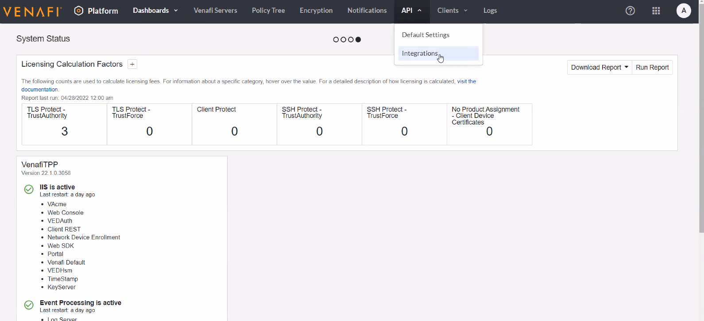

# JET STACK DEMOS


Table of Contents
=================

[Introduction 3](#introduction)

[Kubernetes Ingress 3](#KubernetesIngress)

[Kubernetes Ingress 3](#Issuers)

Introduction
============

Jetstack Secure provides both operations and security teams with a stand-out solution that best meets their respective needs for a high-level of platform automation, coupled with best practice security. With cert-manager (created and maintained primarily by Jetstack, a Venafi company)  at its core, Jetstack Secure delivers comprehensive and highly-automated protection of machine identities, including public trusted certificates for ingress TLS, as well as private certificates for internal workloads using mTLS, including service mesh. It gives platform Leads the confidence to scale-up infrastructure, with full automation that adheres to enterprise security standards and gives both platform and security teams complete visibility, across multiple clusters and cloud providers. 

This guide will go through different usecases and the usage of cert-manager and jetstack secure.

Kubernetes Ingress
============================

Ingress exposes HTTP and HTTPS routes from outside the cluster to services within the cluster. Traffic routing is controlled by rules defined on the Ingress resource.

An Ingress may be configured to give Services externally-reachable URLs, load balance traffic, terminate SSL / TLS, and offer name-based virtual hosting. An Ingress controller is responsible for fulfilling the Ingress, usually with a load balancer, though it may also configure your edge router or additional frontends to help handle the traffic.

An Ingress does not expose arbitrary ports or protocols. Exposing services other than HTTP and HTTPS to the internet typically uses a service of type Service.Type=NodePort or Service.Type=LoadBalancer.


Issuers
============================
Issuers, and ClusterIssuers, are Kubernetes resources that represent certificate authorities (CAs) that are able to generate signed certificates by honoring certificate signing requests. All cert-manager certificates require a referenced issuer that is in a ready condition to attempt to honor the request.

### Venafi Issuer

The Venafi Issuer types allows you to obtain certificates from Venafi as a Service (VaaS) and Venafi Trust Protection Platform (TPP) instances.
You can have multiple different Venafi Issuer types installed within the same cluster, including mixtures of Venafi as a Service and TPP issuer types. 

Automated certificate renewal and management are provided for Certificates using the Venafi Issuer.

## Create an Issuer Resource
A single Venafi Issuer represents a single Venafi 'zone' so you must create one Issuer resource for each zone you want to use. A zone is a single entity that combines the policy that governs certificate issuance with information about how certificates are organized in Venafi to identify the business application and establish ownership.

Issuers can be namespace scoped or cluster scoped

## Certificate Resource

In cert-manager, the Certificate resource represents a human readable definition of a certificate request that is to be honored by an issuer which is to be kept up-to-date. This is the usual way that you will interact with cert-manager to request signed certificates.

A Certificate resource specifies fields that are used to generate certificate signing requests which are then fulfilled by the issuer type you have referenced.


# Configuring TPP
https://TPPURL/vedadmin/

## Create CA Templates
Right Click and add CA template


## Zone / Policies
Create a policies, create nested if required. We will create a policy zone where the certificates requested by certmanager will land.


## Configure Policy

Update the following . 
Certificate tab --> Domain Whitelist to add the allowed domains 
Certificate tab --> Other Information --> Select the CA template


## Generate API Key
The Api key will be used to authenticate between CertManager and the TPP server





## Download TPP CA Bundle

Download the TPP server CA bundle. Copy it top a file tppcabundle.pem


## Cert Manager

> kubectl get po -A

### Deploy Certmanager to the target cluster
 > kubectl apply -f https://github.com/cert-manager/cert-manager/releases/download/v1.8.0/cert-manager.yaml


Securing an Ingress - Usecase 1
===============================
In this use case we will use Venafi TPP to issue signed certificates. We will also be creating both namesapace scoped issuers as well as cluster scoped issuers that connect to 
the TPP server to provision the certificates. We will then deploy a sample application , create certificates resources referenceing the issuers. We will also be creating Ingress resources to secure the applications utilizing certs generated from TPP.


## Create Deployments and Expose Services

```yaml
---
kind: Namespace
apiVersion: v1
metadata:
  name: tea
  labels:
    app: tea
---
kind: Namespace
apiVersion: v1
metadata:
  name: coffee
  labels:
    app: coffee
---
apiVersion: apps/v1
kind: Deployment
metadata:
  name: tea
  namespace: tea
spec:
  replicas: 3
  selector:
    matchLabels:
      app: tea
  template:
    metadata:
      labels:
        app: tea
    spec:
      containers:
      - name: tea
        image: nginxdemos/nginx-hello
        ports:
        - containerPort: 8080
---
apiVersion: v1
kind: Service
metadata:
  name: tea-svc
  namespace: tea
  labels:
spec:
  ports:
  - port: 80
    targetPort: 8080
    protocol: TCP
    name: http
  selector:
    app: tea
  sessionAffinity: None
  type: ClusterIP

---
apiVersion: apps/v1
kind: Deployment
metadata:
  name: coffee
  namespace: coffee
spec:
  replicas: 2
  selector:
    matchLabels:
      app: coffee
  template:
    metadata:
      labels:
        app: coffee
    spec:
      containers:
      - name: coffee
        image: nginxdemos/nginx-hello
        ports:
        - containerPort: 8080
---
apiVersion: v1
kind: Service
metadata:
  name: coffee-svc
  namespace: coffee
  labels:
spec:
  ports:
  - port: 80
    targetPort: 8080
    protocol: TCP
    name: http
  selector:
    app: coffee
  sessionAffinity: None
  type: ClusterIP
---
```

> kubectl apply -f ./kubernetes/ingress/deployment.yaml

## Configure an Ingress

> kubectl apply -f ./kubernetes/ingress/ingress.yaml

> kubectl get ingress -n tea


Update DNS record to point the host to the ipaddress

NOTE: Only port 80 is exposed on the ingress

Access the application


## Creating and Issuer

As described earlier an Issuer can be either namespace or cluster scoped. 

### Namespace scoped Issuer

```yaml
apiVersion: cert-manager.io/v1
kind: Issuer
metadata:
  name: venafi-tpp-issuer
  namespace: venafi-tpp
spec:
  venafi:
    zone: "<REPLACE WITH PATH TO POLICY ZONE>" #"TLS/SSL\\Certificates\\Jetstack-short"
    tpp:
      url: <REPLACE WITH TPPURL/vedsdk> # Change this to the URL of your TPP instance
      caBundle: <REPLACE WITH TPP BASE 64 ENCODED CA BUNDLE>
      credentialsRef:
        name: tpp-auth-secret # A Secret needs to be created with TPP credentials 
```

Creating an issuer requires a TPP instance in this case, the TPP CA bundle , A Policy zone withing tpp with permissions and a secret.
We also require a secret that stores the credentials to access the TPP api instance to life manage certs.

### Create a secret with the access token retrieved from the previous step

### Get access key from TPP
NOTE:  Download vcert
> vcert getcred --username <REPLACE WITH USER-NAME API CLIENT IS ASSIGNED> \
>               --password <REPLACE WITH PASSWORD API CLIENT IS ASSIGNED> \
>               -u https://<REPLACE WITH TPP INSTANCE URL>/vedsdk \
>               --client-id <REPLACE WITH API CLIENT ID> \
>               --scope "certificate:manage,revoke" 


### Copy the access_token


### Create a secret with the access token retrieved from the previous step

> kubectl create secret generic tpp-auth-secret --namespace='tea' --from-literal=access-token='<REPLACE WITH ACCESS TOKEN>'

Since the secret will be the same to access TPP let is create another secret to be used by the cluster issuer in the default namespace

> kubectl create secret generic tpp-auth-secret-cluster --from-literal=access-token='<REPLACE WITH ACCESS TOKEN>'

Check if the secrets are created 

> kubectl get secret -n default
>
> kubectl get secret -n coffee


Convert the tpp server bundle to base64

> echo "$(<tppcabundle.pem)" | base64


